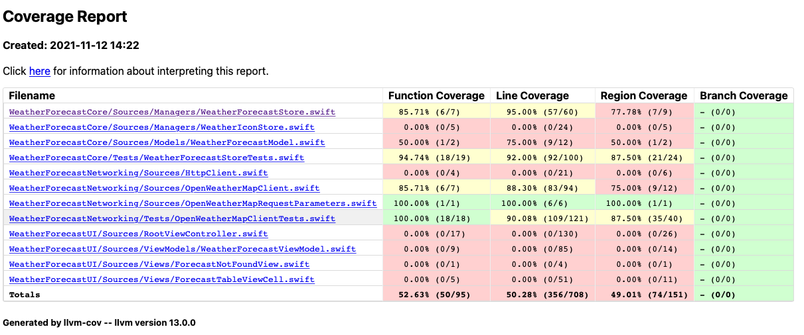

# Weather Forecast Example Application

[](https://github.com/longkh158/WeatherForecast/actions/workflows/makefile.yml)

Author: Long Kim

This repo contains the source code for a simple weather forecast application with data provided from [OpenWeatherMap](https://openweathermap.org).

## Requirements

-   iOS 11.0+ (to provides proper support for safe areas)
-   Xcode 13.0
-   Java Development Kit (**must be JDK 11**).

## How to run locally

```bash
# Set JAVA_HOME to JDK 11 if you haven't already
export JAVA_HOME=/some/path/that/contains/jdk/Home

make install_buck # will download a buck executable at tools/buck
make project
```

Then Xcode will open the generated workspace for you.

## Architectural Design

The project applies the **MVVM** design pattern, coupled with **dependency injection** to achieve a clean and modular codebase.

This brings many advantages:

-   **Separates the view layer from the business logic.** In traditional MVC pattern, particularly in iOS development, the view controller knows too much about the data access, business logic etc. With MVVM, it only needs to know about the view model, and responds to data changes by observing this view model object.
-   **Promotes a modular architecture.** This enhances the development experience, allowing work to be done to different modules at the same time, as well as making writing unit tests much easier.
-   **DI abstracts the implementation from the interface.** This allows mocking in testing for faster/more reliable unit tests, while the level of abstraction means that your implementation of a class can evolve without breaking existing code, leading to longer and more error-prone development process.

## Project Structure

The project is built using [Buck](https://buck.build), a build system developed and used by Facebook. It encourages the creation of small, reusable modules consisting of code and resources, and supports a variety of languages on many platforms.

The project is structured into multiple modules, which provides logical separation as well as speed up builds, as independent modules can be built in parallel. The following graph represents the current modules in the application:


The main modules are:

-   **WeatherForecastCore:** contains the business logic.
-   **WeatherForecastNetworking:** provides request/response handling.
-   **WeatherForecastUI:** provides view layer-related facilities (data sources, view models, etc.)
-   **Resources:** contains app resources (storyboards, strings, XIBs etc.)

## Third-party Frameworks and Libraries

-   [Alamofire](https://github.com/Alamofire/Alamofire): Provides HTTP networking for the application.
-   [AlamofireImage](https://github.com/Alamofire/AlamofireImage): Provides image deserialization, bitmap decoding in the background and a simple caching mechanism, which greatly improves image loading and rendering performance for the application.
-   [Swinject](https://github.com/Swinject/Swinject): Provides dependency injection for the application.
-   [DiffableDataSources](https://github.com/ra1028/DiffableDataSources): A backport of Apple's `UITableViewDiffableDataSource` (iOS 13.0+) for iOS 9.0+, which provides a data source that can compute inserts/deletes/moves efficiently and less error-prone than traditional `performBatchUpdates`.

## Continuous Integration (CI)

This project is configured with [GitHub Actions](https://github.com/features/actions), which will run tests automatically on every push.

Below is the output of an example run, which is triggered on a push:


## Checklist

-   [x] Programming language: Swift is required, Objective-C is optional.
-   [x] Design app's architecture (MVC or MVP, MVVM).
-   [x] UI should be looks like in attachment.
-   [ ] Write UnitTests (nice to have).

    -   Networking Code
    -   Weather Forecast Fetching Logic
    -   UI Test

    Current coverage:
    

-   [x] Exception handling (optional). The app can handle cases where city is not found, and a generic error case.
-   [x] `README` file is included.
